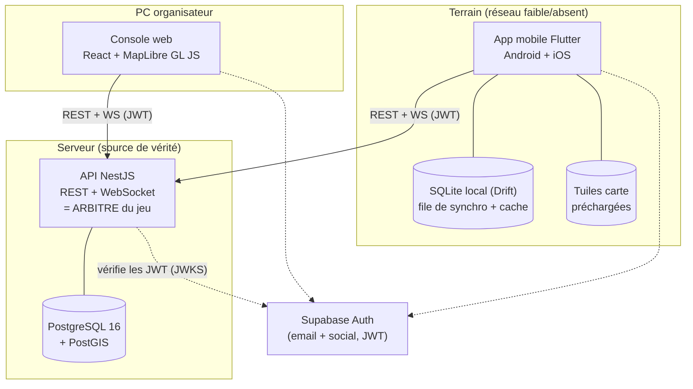

# Architecture — v1 (validée)

> Proposition concrète répondant au §11.1 du [cahier des charges](CAHIER_DES_CHARGES.md).
> Statut : **validée le 2026-07-22** — choix retenus : NestJS/TypeScript, Flutter (Android d'abord), Supabase Auth, PostgreSQL+PostGIS.

## 1. Vue d'ensemble des composants



Points structurants :

- **Un seul chemin d'accès aux données : l'API.** Ni l'app ni la console ne parlent à PostgreSQL ou à Supabase-données. Supabase n'est utilisé que pour l'**authentification** (l'API vérifie les JWT émis). L'API publique de la Phase 5 sera la même API avec une couche ApiKey en plus → principe §2.2 respecté dès la ligne 1.
- **Temps réel maison via WebSocket dans NestJS** (pas Supabase Realtime) : le realtime doit passer par l'arbitre pour filtrer ce que chaque joueur a le droit de voir (positions masquées, chat cloisonné). Un canal realtime « brut » branché sur la base contournerait l'arbitrage → violerait §2.1.
- **La partie vit dans PostgreSQL**, pas sur un téléphone (§2.5). L'API est sans état de session critique : un redémarrage serveur ne perd rien, les clients se reconnectent.

## 2. Choix de stack définitifs

| Brique | Choix | Justification |
|---|---|---|
| App mobile | **Flutter (Dart)** | Une base de code Android+iOS, rendu carte performant, plugin MapLibre mature (`maplibre_gl`) avec téléchargement de régions offline intégré. |
| Carte mobile | **MapLibre GL Native** via `maplibre_gl` | Open source, styles multiples commutables, gestion native des régions offline. |
| Stockage local mobile | **Drift (SQLite)** | File de synchro (outbox), cache des marqueurs/membres, dernière position connue des alliés. Typé, migrations, réactif. |
| Backend / API | **NestJS (Node 22, TypeScript)** | Un seul langage backend + console web ; WebSocket (Socket.IO) de première classe ; architecture modulaire qui colle aux phases ; OpenAPI auto-généré (utile Phase 5). |
| Accès BDD | **Drizzle ORM + SQL brut pour le géospatial** | Drizzle pour le CRUD typé ; les requêtes PostGIS (`ST_DWithin`, `ST_Contains`…) en SQL paramétré — les ORM abstraient mal le géospatial. |
| Base de données | **PostgreSQL 16 + PostGIS** | Requêtes « quels joueurs dans ce rayon » (perk drone), zones de jeu, index géospatiaux. |
| Temps réel | **Socket.IO (gateway NestJS)** | Rooms par partie/équipe/escouade, reconnexion automatique, fallback long-polling. Filtrage serveur par rôle avant diffusion. |
| Auth | **Supabase Auth** | Email + social login gratuits, JWT standards vérifiables côté API via JWKS. Remplaçable (l'API ne dépend que de « un JWT valide → un user_id »). |
| Console web | **React + Vite + TypeScript + MapLibre GL JS** | Même écosystème TS que l'API, même bibliothèque carto que le mobile (styles partagés). |
| Fonds de carte | **1)** Plan vectoriel OpenFreeMap/Protomaps, **2)** IGN Géoplateforme WMTS (Plan IGN, ortho, topo), **3)** satellite | Fonds IGN gratuits (licence ouverte) parfaits pour forêt/relief en France. ⚠️ voir compromis n°2 (licence du cache offline). |
| Déploiement | **Docker Compose** (API + PostgreSQL) ; dev local d'abord, puis VPS (Scaleway/OVH ~5 €/mois) ou Fly.io | Simple, reproductible, sans dépendance à un cloud propriétaire. |
| IDs client-generated | **UUID v7** | Uniques sans coordination (offline, §7.6), triables chronologiquement. |

## 3. Modèle de données détaillé (PostgreSQL)

Conventions : `id` = UUID (v7). `©` = ID généré côté client (offline). Géométries en PostGIS (SRID 4326). Horodatages en `timestamptz`.

### Identité et parties

| Table | Champs clés |
|---|---|
| `users` | id, auth_provider_id (unique), email, pseudo, created_at |
| `games` | id, name, owner_user_id, status (`draft`/`live`/`finished`), starts_at, ends_at, area (Polygon, nullable), settings JSONB (scoring, ressources, fréquence positions), created_at |
| `teams` | id, game_id, name, color |
| `squads` | id, team_id, name |
| `roles` | id, game_id (NULL = modèle par défaut), name, rank (tri hiérarchique), **permissions JSONB** (matrice configurable §5 : `place_marker`, `view_all_teams`, `activate_perk:drone`, `capture_objective`, `manage_members`, `chat:global`, …) |
| `memberships` | id, game_id + user_id (unique ensemble), role_id, team_id, squad_id, life_status (`alive`/`dead`/`medic_needed`/`support`), last_position (Point), last_position_at, is_connected, last_seen_at, joined_at, left_at, kicked_at, kicked_by |

**Membre ≠ connecté (§2.4)** : l'appartenance est la ligne `memberships` (permanente) ; `is_connected`/`last_seen_at` ne sont que le reflet du socket. Une déconnexion met à jour ces deux champs, ne supprime jamais la ligne. Seuls `left_at`/`kicked_at` retirent un joueur.

### Invitations et QR (tous les QR = jetons opaques, §7.2)

| Table | Champs clés |
|---|---|
| `invite_tokens` | id, game_id, role_id, team_id (nullable), **token_hash** (le jeton en clair n'est jamais stocké), max_uses, use_count, expires_at, revoked_at |
| `bonus_qrs` | id, game_id, token_hash, reward JSONB (points/ressource), attachment_url, max_scans_total, max_scans_per_player, carrier_membership_id (nullable — QR porté par un joueur §7.9) |
| `qr_scans` | id, source (`invite`/`objective`/`bonus`), source_id, membership_id, scanned_at — journal d'audit + idempotence (re-scan du même QR = refusé proprement) |

Le QR encode `https://<domaine>/j/<jeton-opaque>` : scannable aussi par l'appareil photo natif (deep link), et le serveur seul sait ce que le jeton donne.

### Objets tactiques (cœur de l'offline, §7.6)

| Table | Champs clés |
|---|---|
| `map_objects` © | **id fourni par le client**, game_id, author_membership_id, kind (`marker`/`line`/`zone`), marker_type (`hostile`/`waypoint`/`poi`/`spawn`/…), geometry (Geometry), properties JSONB (label, couleur, **icon** — clé dans le pack d'icônes), visibility (`global`/`team`/`squad`), **created_at (horloge client)**, server_received_at, updated_at (horloge serveur — sert au LWW et au delta), deleted_at (tombstone) |

**Icônes d'unités : pack fourni par le propriétaire du projet.** Le rendu des marqueurs (mobile et console) est piloté par les données : chaque marqueur référence une clé d'icône (`properties.icon`), résolue dans un pack d'icônes chargé dans le style MapLibre (images enregistrées au démarrage). Le pack vit dans `packages/assets/icons/` (SVG préféré, PNG accepté), partagé entre l'app Flutter et la console web. Ajouter une icône = déposer un fichier + une entrée de registre, sans toucher au code de rendu.
| `messages` © | id client, channel_id, author_membership_id, body, created_at (client), server_received_at |
| `chat_channels` | id, game_id, scope (`global`/`team`/`squad`), team_id, squad_id — créés automatiquement avec la partie/les équipes |
| `position_logs` | membership_id, position, recorded_at — alimente les stats post-partie (Phase 5) ; politique de purge dès le départ pour maîtriser le volume |

### Gamification (Phase 4)

| Table | Champs clés |
|---|---|
| `objectives` | id, game_id, name, position (Point), qr_token_hash, capture_order (nullable), allowed_role_ids UUID[], reward JSONB, holder_team_id, last_captured_at, last_captured_by |
| `objective_links` | from_objective_id, to_objective_id (liens visuels + prérequis d'ordre) |
| `objective_captures` | objective_id, membership_id, team_id, captured_at — historique complet |
| `perk_definitions` | id, game_id, type (`drone`/`jammer`/`emp`/…), params JSONB (rayon, durée, cooldown), allowed_role_ids, per_team_stock |
| `perk_instances` | id, definition_id, game_id, caster_membership_id, target_geometry / target_membership_id, starts_at, ends_at, state (`active`/`expired`/`jammed`) |

### Ouverture (Phase 5)

| Table | Champs clés |
|---|---|
| `api_keys` | id, owner_user_id, token_hash, label, purpose (but déclaré), permissions (`read`/`write`/`admin`), game_ids UUID[], created_at, revoked_at |

## 4. Surface d'API

REST versionné `/v1`, OpenAPI auto-généré par NestJS. JWT Supabase dans `Authorization: Bearer` (les ApiKeys de la Phase 5 emprunteront exactement le même pipeline avec un garde supplémentaire).

### Endpoints principaux (par phase)

```
Phase 1
  GET    /v1/me                                 profil + parties
  POST   /v1/games                              créer une partie (serveur = propriétaire, §2.5)
  GET    /v1/games/:id                          état complet (filtré selon rôle)
  GET    /v1/games/:id/members                  membres + statuts + dernières positions autorisées
  PATCH  /v1/games/:id/members/me               changer son statut de vie

Phase 2
  POST   /v1/games/:id/map-objects/batch        vidage de la file offline (upsert idempotent sur id client)
  GET    /v1/games/:id/sync?since=<curseur>     delta : tout ce qui a changé depuis (incl. tombstones)
  GET    /v1/games/:id/channels/:cid/messages?since=

Phase 3
  POST   /v1/invites                            créer un QR d'invitation (rôle, usages, expiration)
  DELETE /v1/invites/:id                        révoquer
  POST   /v1/join                               { token } → le serveur résout rôle+partie et crée le membership
  PATCH  /v1/games/:id/members/:mid             rétrograder / exclure (permission requise)

Phase 4
  POST   /v1/scan                               { token } → le serveur identifie le type (objectif/bonus)
                                                et arbitre : grade autorisé ? ordre respecté ? déjà scanné ?
  POST   /v1/games/:id/perks/:defId/activate    { cible } → validation serveur (stock, cooldown, rôle)

Phase 5
  POST   /v1/api-keys …                         gestion des clés
  POST   /v1/games/:id/layers/import            GeoJSON/KML → calque natif
```

### Événements WebSocket (Socket.IO, namespace `/game`)

| Sens | Événement | Contenu |
|---|---|---|
| client → serveur | `position` | lat/lng/précision/cap (fréquence réglée par la partie) |
| client → serveur | `status` | changement de statut de vie |
| serveur → clients | `member:update` | position/statut/connexion d'un allié — **filtré par rôle et équipe avant émission** |
| serveur → clients | `object:upsert` / `object:delete` | marqueurs et dessins synchronisés |
| serveur → clients | `chat:message` | vers la room du canal uniquement |
| serveur → clients | `game:event` | capture d'objectif, perk activé/terminé, joueur rejoint/exclu |
| serveur → clients | `perk:reveal` | positions hostiles révélées par un drone — émis uniquement aux ayants droit, pendant la durée du perk |

Anti-triche : le serveur n'émet **jamais** les positions ennemies en dehors d'un `perk:reveal` actif. Le client ne les possède donc pas (il ne peut pas « décacher » ce qu'il n'a pas reçu).

## 5. Conception offline-first (mécanique précise)

### Écriture locale → serveur (outbox)
1. Toute création locale (marqueur, message, statut) reçoit un **UUID v7 client** + `created_at` horloge client, est écrite dans Drift et affichée immédiatement avec le badge « en attente de synchro ».
2. Une file d'attente persistante (table `outbox` dans Drift) est vidée dès que le réseau revient : `POST /map-objects/batch`. L'upsert serveur est **idempotent sur l'id client** → aucun doublon même si la réponse se perd et que l'app renvoie.
3. Réponse serveur → badge « synchronisé ».

### Serveur → local (delta)
1. L'app garde un **curseur de synchro** (le plus grand `updated_at` serveur reçu).
2. À la reconnexion : `GET /sync?since=<curseur>` renvoie objets créés/modifiés/supprimés (tombstones), membres et messages manqués. Ensuite le WebSocket reprend le fil en continu.
3. Conflits : **last-write-wins sur l'horloge serveur** (`updated_at`), conforme §7.6 — les marqueurs sont surtout des ajouts.

### Dégradé hors ligne (jamais un plantage)
| Fonction | Hors ligne |
|---|---|
| Carte préchargée, boussole, ses propres marqueurs/dessins | ✅ pleinement fonctionnels |
| Alliés | ✅ dernière position connue, grisés, « il y a X min » |
| Chat | envoi mis en file, réception au retour |
| Perks, capture QR, scan bonus | ❌ grisés + « Indisponible hors connexion » (l'arbitre est injoignable) |

## 6. Sécurité et anti-triche (rappel des invariants)

1. Le client n'envoie que des **intentions** (« je veux activer le drone », « j'ai scanné ce jeton ») ; le serveur vérifie rôle, stock, cooldown, ordre de capture, et décide.
2. Les positions ennemies ne quittent jamais le serveur hors perk actif (cf. §4).
3. Tous les jetons (invitations, objectifs, bonus, API keys) sont **opaques, hachés en base**, à usage compté, révocables.
4. La matrice de permissions est **données, pas code** : configurable par partie sans redéploiement.
5. Journal `qr_scans` + `objective_captures` : auditable en cas de litige entre joueurs.

## 7. Structure du monorepo

```
carto-airsoft/
├── apps/
│   ├── api/          NestJS (modules: auth, games, members, sync, chat, realtime, …)
│   ├── mobile/       Flutter
│   └── console/      React + Vite
├── packages/
│   └── shared/       Types TS partagés API↔console (DTOs, événements WS, permissions)
├── docker-compose.yml   PostgreSQL+PostGIS (+ API en prod)
├── CAHIER_DES_CHARGES.md
└── ARCHITECTURE.md
```

(Flutter ne consomme pas les types TS ; le contrat côté mobile est l'OpenAPI généré → génération de clients Dart possible.)

## 8. Découpage concret de la Phase 1

Chaque jalon est démontrable.

1. **Socle projet** : monorepo, docker-compose PostgreSQL+PostGIS, NestJS qui démarre, `GET /v1/health`.
2. **Auth** : projet Supabase, login email dans l'app Flutter, garde JWT côté API, `GET /v1/me`.
3. **Carte** : MapLibre dans l'app, 3 fonds commutables (plan / IGN topo / satellite), position GPS affichée.
4. **Offline carte** : téléchargement d'une région (emprise + niveaux de zoom) depuis l'app, vérifiable en mode avion.
5. **Partie minimale** : `POST /games` + rejoindre en dev (les QR arrivent en Phase 3), service Android de premier plan pour le GPS en arrière-plan.
6. **Temps réel** : gateway Socket.IO, diffusion positions+statuts aux membres, statuts de vie, indicateur « hors ligne / dernière position il y a X min » (§2.4).

## 9. Compromis à arbitrer (§11.4)

1. **iOS exige un Mac pour compiler.** Développement sur Windows → cible **Android d'abord**, build iOS ensuite via CI cloud (Codemagic/GitHub Actions macOS). Flutter garantit que le code sera le même.
2. **Licences des tuiles offline.** Le préchargement massif est interdit par les serveurs publics OSM ; les fonds IGN Géoplateforme sont en licence ouverte (à confirmer par couche). Stratégie : fonds vectoriel auto-hébergeable (PMTiles/OpenFreeMap) comme fond principal cacheable sans limite + IGN en ligne quand le réseau le permet. À trancher en Phase 1 jalon 4.
3. **Batterie vs précision.** Position toutes les 5 s (précis, ~drain fort) à 30–60 s (économe). Réglable par l'ORGA dans la config de partie + mode éco côté joueur. Défaut proposé : 10 s.
4. **Fiabilité Android en arrière-plan.** Service de premier plan avec notification persistante obligatoire, plus guide utilisateur pour whitelister l'app (dontkillmyapp). Sans cela, positions figées écran éteint.
5. **Coûts de démarrage.** Supabase Auth gratuit, PostgreSQL local en dev, VPS ~5 €/mois en test terrain. Aucun coût tant qu'on développe.
